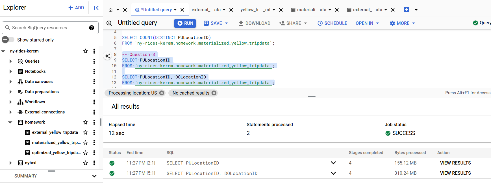
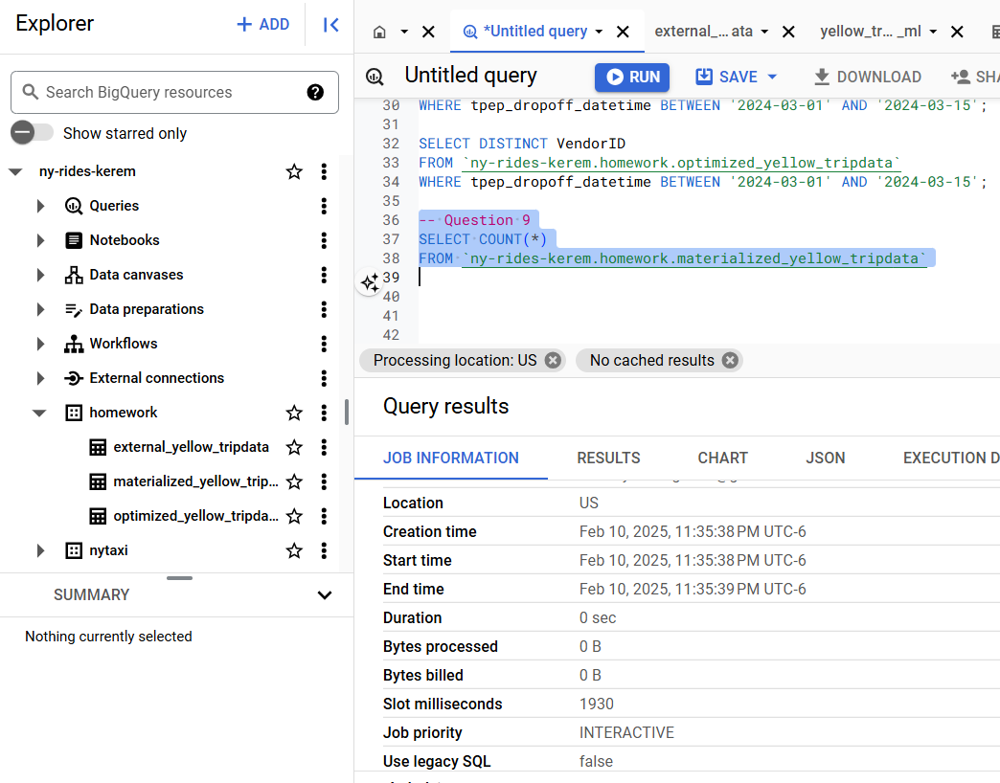

### Question 1
Question 1: What is count of records for the 2024 Yellow Taxi Data?

### Question 2
Write a query to count the distinct number of PULocationIDs for the entire dataset on both the tables.
What is the estimated amount of data that will be read when this query is executed on the External Table and the Table?

### Question 3
Write a query to retrieve the PULocationID from the table (not the external table) in BigQuery. Now write a query to retrieve the PULocationID and DOLocationID on the same table. Why are the estimated number of Bytes different?

Answer: BigQuery is a columnar database, and it only scans the specific columns requested in the query. Querying two columns (PULocationID, DOLocationID) requires reading more data than querying one column (PULocationID), leading to a higher estimated number of bytes processed.

### Question 4
How many records have a fare_amount of 0?

### Question 5
What is the best strategy to make an optimized table in Big Query if your query will always filter based on tpep_dropoff_datetime and order the results by VendorID (Create a new table with this strategy). 

Answer: Partition by tpep_dropoff_datetime and Cluster on VendorID

### Question 6
Write a query to retrieve the distinct VendorIDs between tpep_dropoff_datetime 2024-03-01 and 2024-03-15 (inclusive)
Use the materialized table you created earlier in your from clause and note the estimated bytes. Now change the table in the from clause to the partitioned table you created for question 5 and note the estimated bytes processed. What are these values?

### Question 7
Where is the data stored in the External Table you created?
Answer: GCP Bucket

### Question 8
It is best practice in Big Query to always cluster your data:
True
False
Answer: False

### Question 9
Write a SELECT count(*) query FROM the materialized table you created. How many bytes does it estimate will be read? Why?

Answer: I got 0 bytes processed as the result of the given query. I am guessing it is because of the query caching of BigQuery(for around 24 hours window).

