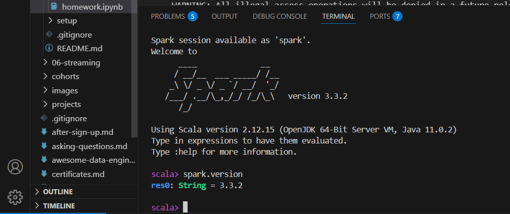
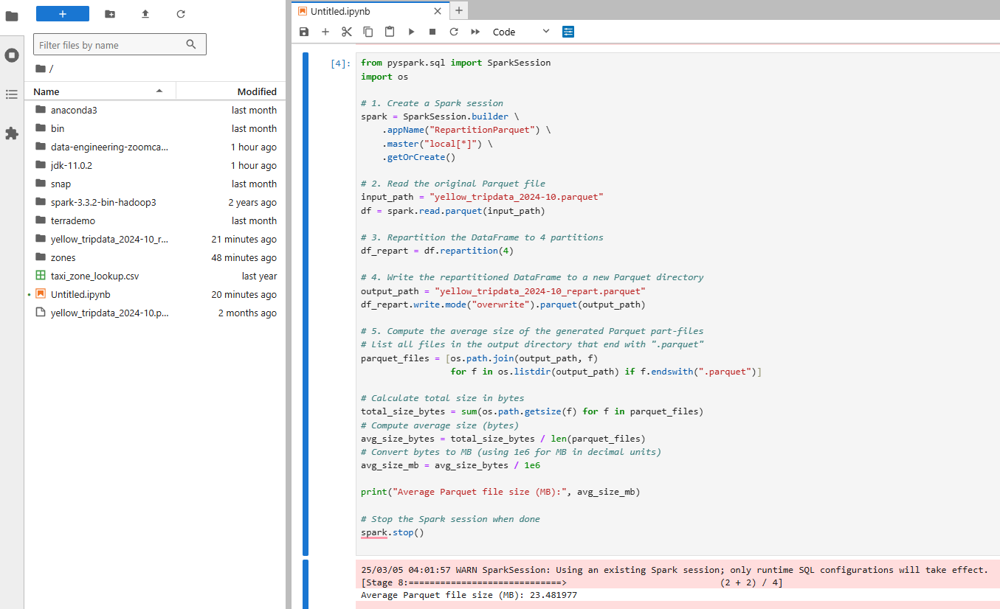
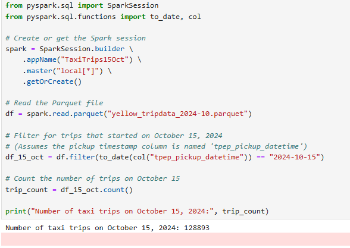
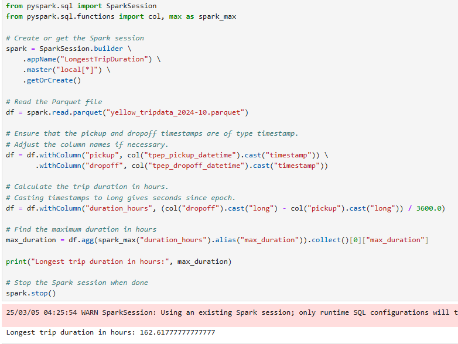
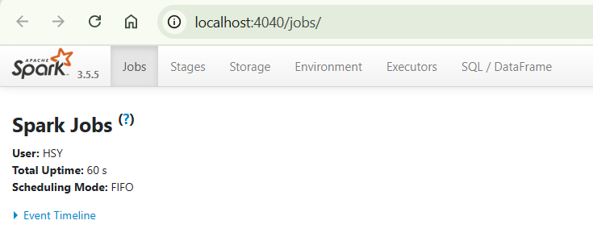
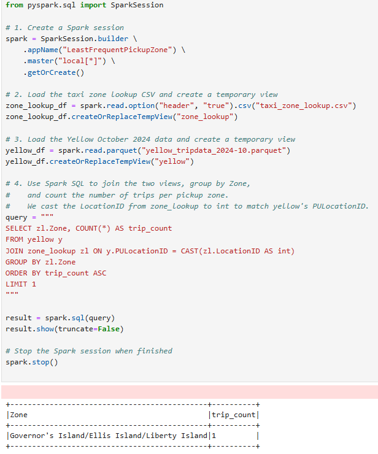

### Question 1
Question 1: What is the spark version?

### Question 2
What is the average size of the Parquet (ending with .parquet extension) Files that were created (in MB)?

### Question 3
How many taxi trips were there on the 15th of October?

### Question 4
What is the length of the longest trip in the dataset in hours?

### Question 5
Spark’s User Interface which shows the application's dashboard runs on which local port?

### Question 6
Using the zone lookup data and the Yellow October 2024 data, what is the name of the LEAST frequent pickup location Zone?

