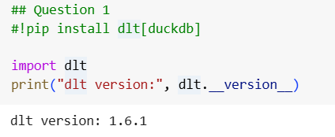
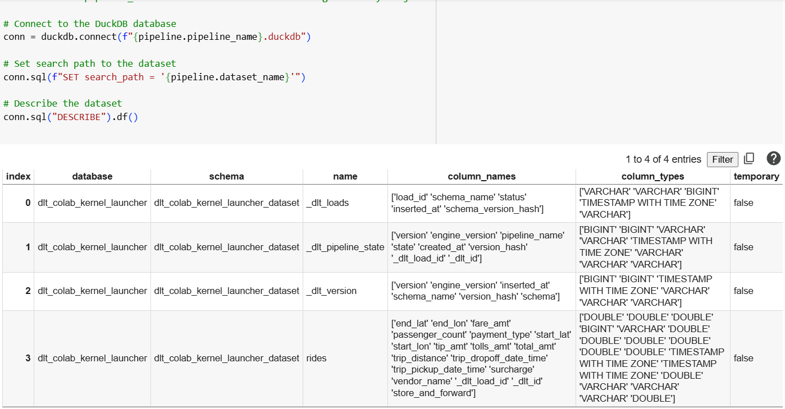
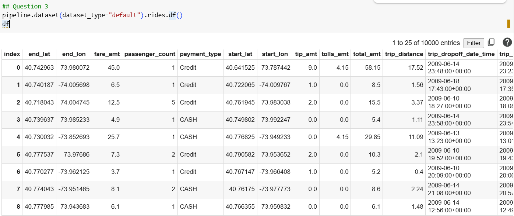
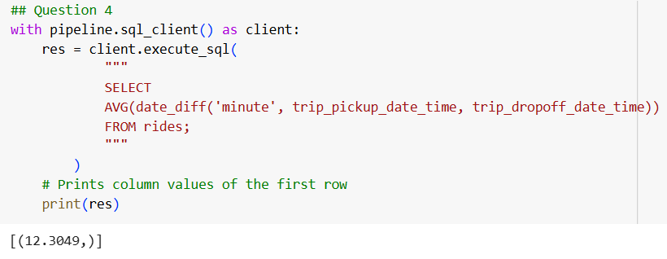

### Question 1
Question 1. The version of dlt.

### Question 2
Question 2. How many tables were created?

### Question 3
Question 3. The total number of records extracted?

### Question 4
Question 4. Average trip duration

